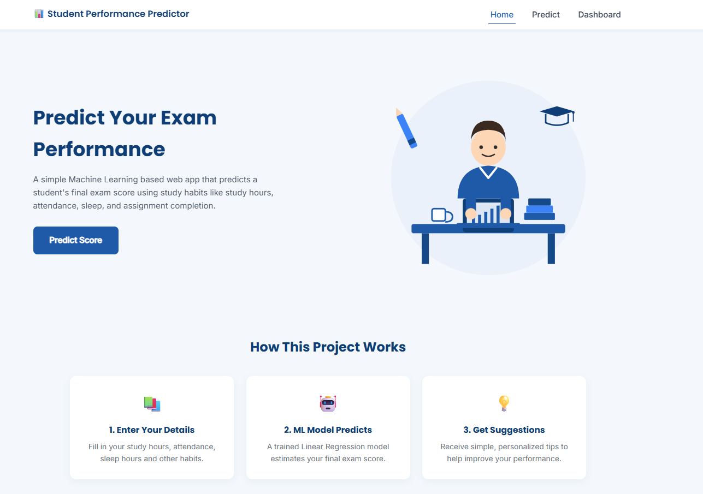
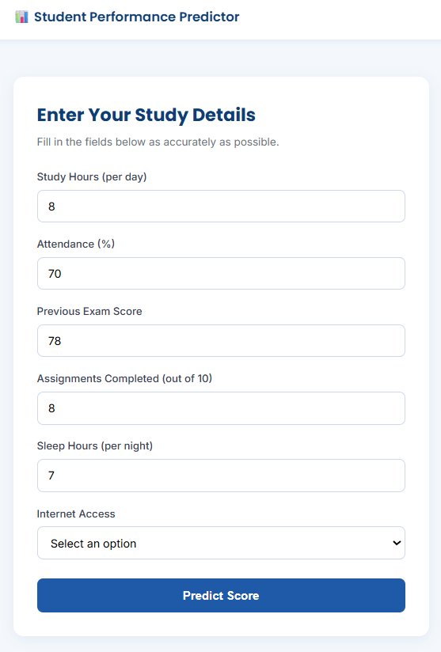
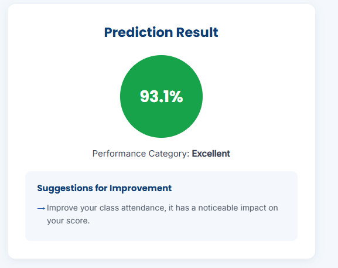
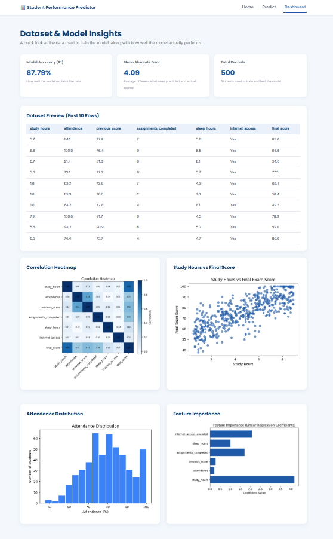

# 📊 Student Performance Predictor

A simple Machine Learning based web application that predicts a student's final exam score using their study habits — built with Flask, scikit-learn, and a clean blue-white UI.

This project was built as part of my final year B.Tech portfolio to apply Machine Learning concepts in a practical, end-to-end web application.

---

## 🎯 Project Overview

The goal of this project is to estimate how well a student is likely to perform in their final exam, based on measurable study habits like study hours, attendance, sleep, and assignment completion.

It uses a **Linear Regression** model trained on a synthetic (but realistic) dataset of 500 students, and wraps it in a Flask web app with three pages:

- **Home** — project introduction
- **Predict** — enter your details and get a predicted score + suggestions
- **Dashboard** — dataset insights, charts, and model accuracy

---

## ✨ Features

- Predicts final exam score (0–100%) based on 6 input features
- Classifies performance into **Excellent / Good / Average / Needs Improvement**
- Gives personalized suggestions (e.g. increase study hours, improve attendance, sleep more)
- Interactive dashboard with:
  - Dataset preview table
  - Correlation heatmap
  - Study Hours vs Final Score scatter plot
  - Attendance distribution histogram
  - Feature importance chart
  - Model accuracy (R² score) and Mean Absolute Error
- Input validation with clear error messages
- Loading animation while the prediction is processed
- Fully responsive design (works on mobile, tablet, desktop)
- Clean blue-and-white theme using Google Fonts (Poppins + Inter)

---

## 📸 Screenshots

<table>
<tr>
<td></td>
<td></td>
</tr>

<tr>
<td></td>
<td></td>
</tr>
</table>

## 🛠️ Technologies Used

| Category | Tools |
|----------|-------|
| Backend | Python, Flask |
| Machine Learning | scikit-learn, Pandas, NumPy, Joblib |
| Visualization | Matplotlib |
| Frontend | HTML5, CSS3, JavaScript |
| Fonts | Google Fonts (Poppins, Inter) |

---

## 📁 Project Structure